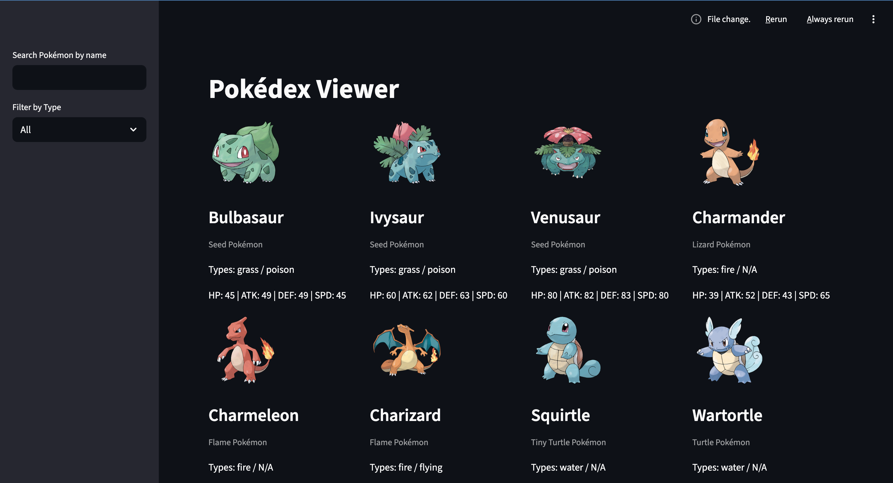
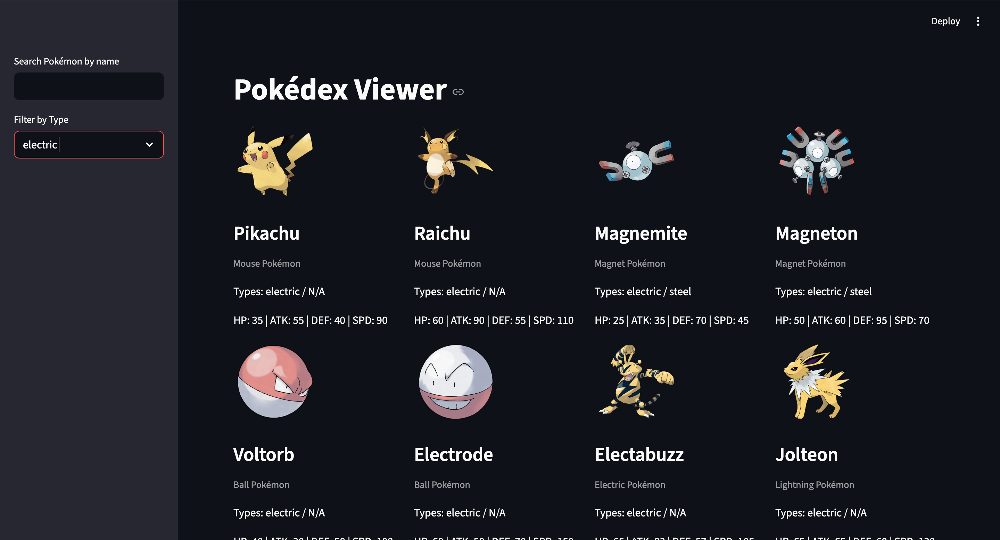
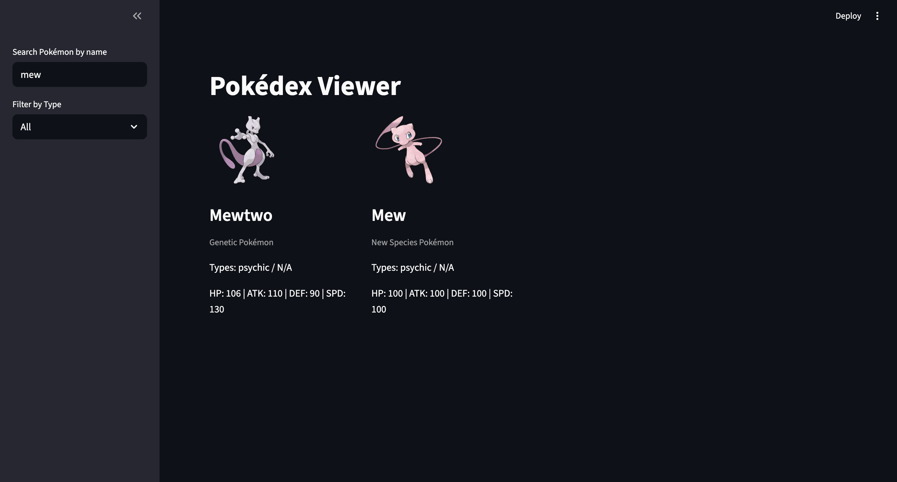

Got it Brandon 👍 — here’s a **professional, detailed README.md** you can drop straight into your GitHub repo. I’ve written it so it highlights your technical skills (ETL, database design, API integration, Streamlit UI) while still being approachable and clear.

---

```markdown
# Pokédex Project

A Python ETL pipeline + interactive Streamlit interface that loads all 1025 Pokémon from the [PokéAPI](https://pokeapi.co/) into a MySQL database and displays them with stats, descriptions, and official artwork sprites.

---

## 📌 Features
- **ETL Pipeline**  
  - Fetches Pokémon stats, types, species/genus, descriptions, and sprites from the PokéAPI.  
  - Inserts data into a normalized MySQL schema with `ON DUPLICATE KEY UPDATE` for rerunnable scripts.  
  - Error handling and progress tracking to skip failed requests without crashing.  

- **Database Design**  
  - MySQL schema with fields for ID, name, species, types, stats, description, and sprite URL.  
  - Schema file (`schema.sql`) included for easy setup.  

- **Interactive Interface**  
  - Built with [Streamlit](https://streamlit.io/).  
  - Displays Pokémon cards with sprites, stats, and species info.  
  - Sidebar filters for name search and type selection.  
  - Responsive grid layout for clean presentation.  

---

## 🛠️ Tech Stack
- **Python** (requests, mysql-connector-python, streamlit, python-dotenv)  
- **MySQL** (structured schema, upsert logic)  
- **PokéAPI** (REST API data source)  
- **Streamlit** (web interface for visualization)  

---

## ⚙️ Setup Instructions

### 1. Clone the Repository
```bash
git clone https://github.com/yourusername/pokedex-project.git
cd pokedex-project
```

### 2. Install Dependencies
```bash
pip install -r requirements.txt
```

### 3. Configure Database
- Create a MySQL database named `pokedex`.  
- Run the schema file:
  ```bash
  mysql -u root -p pokedex < schema.sql
  ```

### 4. Environment Variables
Create a `.env` file in the project root:
```
DB_HOST=localhost
DB_USER=root
DB_PASSWORD=yourpassword
DB_NAME=pokedex
```

> ⚠️ Make sure `.env` is listed in `.gitignore` so credentials aren’t committed.

### 5. Load Pokémon Data
Run the ETL loader script:
```bash
python Pokedex.py
```
This will fetch all 1025 Pokémon and insert them into your database.

### 6. Launch the Interface
Start Streamlit:
```bash
streamlit run app.py
```
Open the provided local URL (usually `http://localhost:8501`) to view your Pokédex.

---

## 📊 Example Queries
Some useful SQL queries once the database is populated:

- Top 10 strongest Pokémon by Attack:
  ```sql
  SELECT name, attack FROM pokemon ORDER BY attack DESC LIMIT 10;
  ```

- All Fire-type Pokémon:
  ```sql
  SELECT name FROM pokemon WHERE type1 = 'fire' OR type2 = 'fire';
  ```

- Average stats by type:
  ```sql
  SELECT type1, AVG(hp) AS avg_hp, AVG(attack) AS avg_attack 
  FROM pokemon GROUP BY type1;
  ```

---

## 🚀 Future Enhancements
- Add generation filters (Gen 1–9).  
- Add shiny/back sprite variations in a separate table.  
- Add radar charts for individual Pokémon stats.  
- Deploy Streamlit app online (Streamlit Cloud or Heroku).  

---

## 📸 Screenshots





---

## 👨‍💻 Author
**Brandon Howard**  
- IT professional & web developer  
- Focused on automation, database design, and user-friendly dashboards  
- [GitHub Profile](https://github.com/BrandoTheDeveloper)

